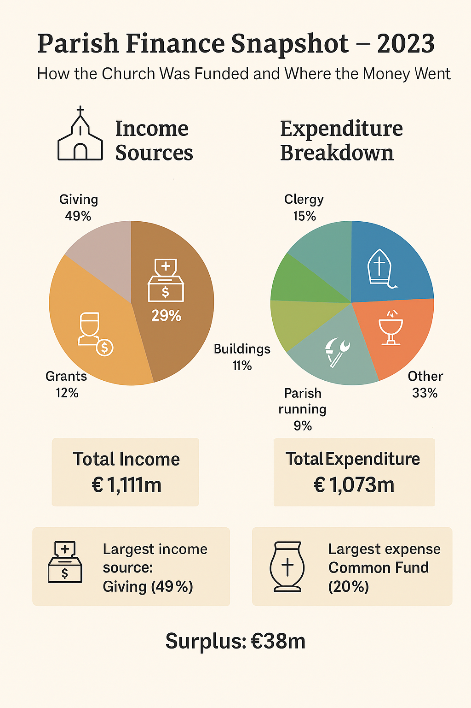

# 🚀 Church of England Data Insights Project

<!--  -->

<!-- | Feature | Status | -->
<!-- |---------|--------| -->
<!-- |  | ✅ Under Development | -->

<table>
  <tr>
    <td></td>
    <!-- <td><h2>About Me</h2></td> -->
    <td><h4>Welcome to my Church of England Data Insights Project! This site showcases a personal project to analyze the financial trends across Church of England dioceses over the period 2003-2023. 
            The project examines income and expenditure patterns to identify key insights and regional variations. </h4></td>
  </tr>
</table>

# Diocesan Financial Analysis

<!-- - 🏛️ **Parish demographics and structures** -->

The Church of England regularly publishes a wide range of statistics to support research and decision-making, including:

- Parish finance statistics          
- Church attendance statistics  
- Ministry statistics  
- Cathedral statistics  
- Energy Footprint Tool and Energy Toolkit  
- Fresh Expressions of Church  

While these are all valuable areas of study, monitoring financial performance is important for keeping track of an organization’s financial health and for finding out where it might be vulnerable,
and identify when it is necessary to take action. The goal is to help congregations to see how their contributions create ministry impact while maintaining the financial transparency that builds trust and accountability. 
Whether you're a researcher, church leader, policy maker, or simply curious about the Church's presence and impact across England, this project aims to provide meaningful insights grounded in real data.

<!-- ## 📈 Sample Visualization -->
<!-- Below is an infographic summarizing where the Church's money typically comes from and where it has gone over the period 2014-2023: -->

<!--  -->

## Dataset Overview

The analysis covers:
- **Time Period**: 2014-2023 (10 years), but begins, initially, with a 20-year overview of the income & expenditure trend across all dioceses
- **Geographic Scope**: All Church of England dioceses
- **Financial Metrics**: Annual income and expenditure data
- **Data Source**: Church of England parish finance statistics

## Interactive Dashboards

💡 **Tip**: Use Ctrl+click on the links below to "Open in a new tab" and keep this README page open

### 📊 [Income & Expenditure Trends - 20 Year Overview](https://public.tableau.com/app/profile/nawaz.hossain/viz/diocesan_dashboard1/Dashboard1) 

**Features:**
- 20-year overview of financial trends across all dioceses
- **Filters Available**: Filter by individual dioceses
- **Interactive Elements**: Hover for detailed figures, click to highlight specific years
- Compares actual income and expenditure with values adjusted for inflation (real terms 2023)

**Summary:**
To provide meaningful comparisons, this first dashboard shows the long-term trend in income and expenditure from 2003 to 2022. Although 2023 saw income and expenditure recover to pre-pandemic levels, they continue to be eroded by the effects of inflation. Real terms income and expenditure (i.e. adjusted for inflation) were both slightly down on corresponding totals from 2022. Real terms income was 15% lower and expenditure 16% lower than in 2019. Income continued to exceed expenditure, as it has done every year since 2011, with a 3.5% margin reported for 2023. Real terms expenditure was lower in 2023 than in any of the previous twenty years. 

### 📈 Sources of Income & Areas of Expenditure |  [Dashboard 1](https://public.tableau.com/app/profile/nawaz.hossain/viz/diocesan_dashboard2/Dashboard2)  |  [Dashboard 2](https://public.tableau.com/app/profile/nawaz.hossain/viz/diocesan_dashboard3/Dashboard3)  |  

**Features:**
- Overview of income and expenditure across all dioceses
- **Filters Available**: Select specific dioceses
- **Interactive Elements**: Click category names to focus, hover for exact values
- Identifies largest sources of income and areas of costs (£m)

**Summary:**
The largest source of income was giving, which (together with tax recovered) accounted for £596 million. The largest costs were mission and ministry (comprising diocesan Common Fund contributions, mission giving, mission outreach and staff expenses, of which £315 million were through contributions to diocesan Common Fund. 

### 📊 [The Common Fund](https://public.tableau.com/app/profile/nawaz.hossain/viz/diocesan_dashboard4/Dashboard4) 

**Features:**
- Focus on Diocesan Common Fund contributions across all dioceses
- **Filters Available**: Select specific categories of spending

**Summary:**
The Church of England Common Fund is a contribution from every church in the Church of England towards the costs of ministry and mission across their diocese. It's essentially a system of financial sharing between parishes and their dioceses.
The Common Fund works by having parishes contribute funding to their diocese in order to fund expenditure at the diocesan level, much of which is in support of the parishes. This includes covering costs of stipendiary clergy, including stipends, pensions, housing and training.

### 📈 [Diocesan Comparison Analysis](https://public.tableau.com/app/profile/nawaz.hossain/viz/diocesan_incexp_trends/Dashboard2)
**Features:**
- Side-by-side comparison of all dioceses
- **Filters Available**: Select specific years, filter by income/expenditure ranges
- **Interactive Elements**: Click diocese names to focus, hover for exact values
- Identifies highest and lowest performing dioceses financially

**Summary:**

### 📈 More Dashboards are coming ... 

## How to Use the Dashboards

1. **Year Filtering**: Use the year slider/dropdown to focus on specific time periods
2. **Diocese Selection**: Click on diocese names or use the filter panel to compare specific regions
3. **Data Exploration**: Hover over data points for detailed financial figures
4. **Trend Analysis**: Toggle between income and expenditure views using the legend

## Key Insights

- Overall financial trends across the decade
- Dioceses showing significant growth or decline
- Impact of external factors on church finances
- Regional variations in financial performance

## 🔍 Data Sources
All data used in this project is sourced from official Church of England open datasets and publications (ref: Parish-Finance-Statistics-2023.pdf).
The data presents a national summary of financial activity for Church of England parishes in 2023, as measured through the annual Return of Parish Finance.

## 🚀 Features

- Cleaned and structured datasets ranging years from 2014 to 2023
- Interactive visualizations and dashboards exploring trends and patterns
- Dynamic filter tools for comparing dioceses, and years

<!-- 📊 <a href="https://public.tableau.com/app/profile/nawaz.hossain/viz/diocesan_incexp_trends/Dashboard1" target="_blank">Income & Expenditure trend 10 Year Overview</a> -->

<!-- 📊 <a href="https://public.tableau.com/app/profile/nawaz.hossain/viz/diocesan_incexp_trends/Dashboard2" target="_blank">Income & Expenditure per Diocese</a> -->

<!-- 📊 [Income & Expenditure Overview](https://public.tableau.com/app/profile/nawaz.hossain/viz/diocesan_incexp_trends/Dashboard1) -->

